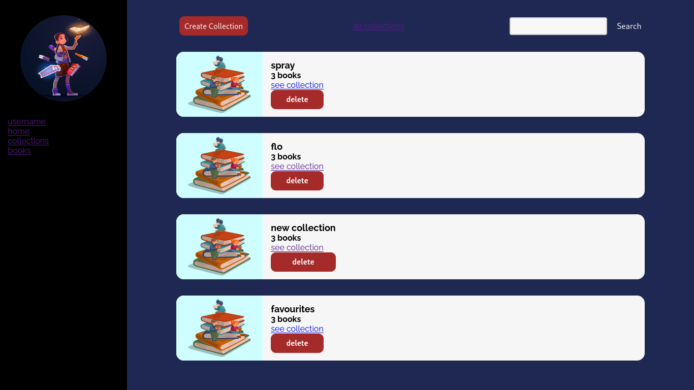
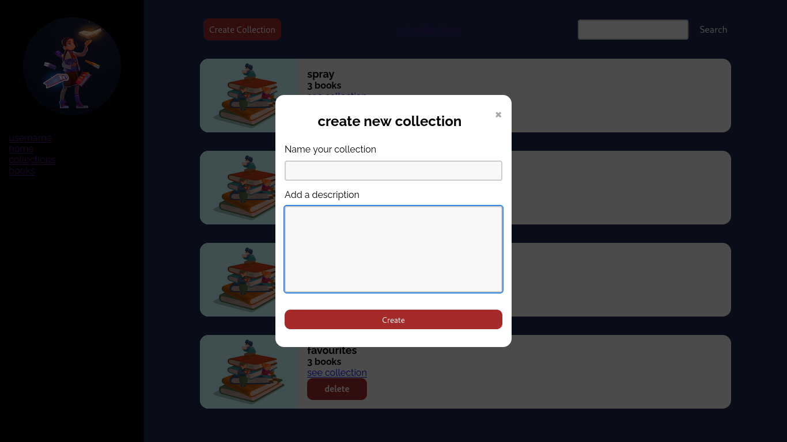
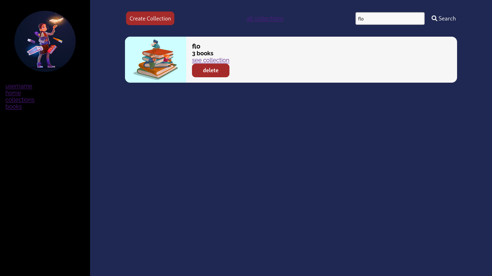
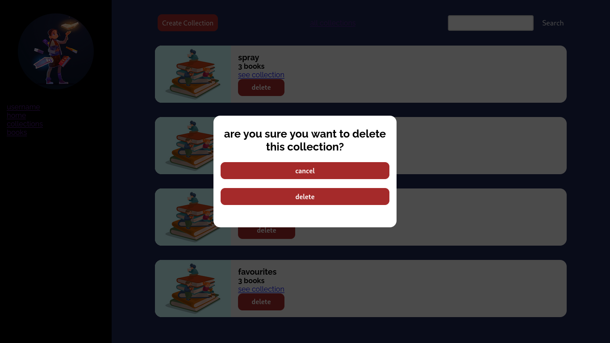

# Book Manager
collections dashboard

create new collection

search collection

delete collection

### collections page

- [x] create new collection
- [x] see all collections created
- [x] search collection
- [x] delete collection
- [ ] add pagination to collections

### single collection page

- [x] see collection info-page
- [ ] update collection infos
- [ ] add books to collection
- [ ] display books in collection
- [ ] remove book from collection

